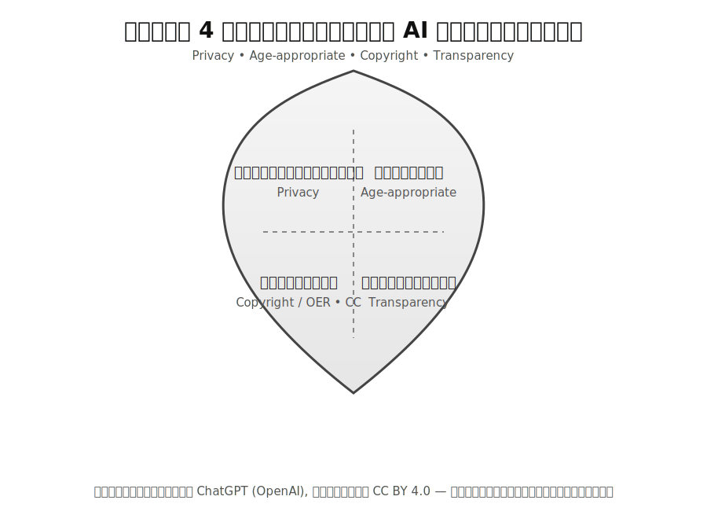

# เกราะ 4 ชิ้นของการใช้ AI ในชั้นเรียน

## 1) ไม่ป้อนข้อมูลส่วนบุคคลของนักเรียน/ผู้ปกครอง (ใช้ข้อมูลสมมุติ)

**นิยามย่อ:** ข้อมูลที่ระบุตัวบุคคลได้โดยตรงหรือโดยอ้อม (ชื่อ–สกุล รหัสนักเรียน หมายเลขติดต่อ อีเมล ใบหน้า เสียง ไฟล์งานที่มี metadata) ต้องไม่นำเข้าเครื่องมือ AI

**ทำ (Do):**

* ใช้ **ข้อมูลสมมุติ/การทำข้อมูลไม่ระบุตัวตน** (pseudonymization/de-identification) เช่น รหัส “S01”, “ผู้เรียน ก.”
* ลบ/ ปกปิด metadata ของไฟล์ก่อนอัปโหลด (เช่น EXIF ของภาพ, properties ของเอกสาร)
* เก็บกรณีศึกษาเป็น **สังเคราะห์** (synthetic scenarios) ไม่เชื่อมกับเหตุการณ์จริงของนักเรียน

**ไม่ทำ (Don’t):**

* ไม่ใส่ชื่อ–สกุล รูปถ่าย ใบรับรองแพทย์ คะแนน รายงานพฤติกรรม รายละเอียดครอบครัว
* ไม่ผูกข้อมูลหลายชิ้นเข้าด้วยกันจนย้อนกลับไประบุตัวบุคคลได้

**ตัวอย่าง:**

* ✅ “นักเรียน ก. (S03) ลืมส่งงานคณิตภายในกำหนด 2 วัน”
* ❌ “น.ส. ขวัญใจ ศรี… ห้อง 5/2 เลขที่ 17 ลืมส่งงานเมื่อ 3 ก.ย.”

**เช็กลิสต์ก่อนใช้เครื่องมือ AI (ย่อ):**
\[ ] ใช้ตัวระบุสมมุติแทนชื่อจริง
\[ ] ลบ metadata/ข้อมูลซ่อนในไฟล์
\[ ] ไม่มีรายละเอียดที่นำไปสู่การระบุตัวบุคคล

---

## 2) เหมาะวัย & ปลอดอคติ: ตรวจถ้อยคำ ภาพ ตัวอย่าง ให้ปลอดภัยและครอบคลุม

**นิยามย่อ:** เนื้อหา สื่อ และภาษาต้องสอดคล้องกับพัฒนาการทางอายุ ลดความเสี่ยงด้านเนื้อหาอ่อนไหว และไม่ตอกย้ำอคติ/เหมารวม

**ทำ (Do):**

* กำหนดระดับเนื้อหาให้ **เหมาะวัย** (เช่น ความยากของภาษา ความยาว ตัวอย่างทางวัฒนธรรม)
* ทำ **bias check** 3 มิติ: (1) เพศและอัตลักษณ์ (2) เชื้อชาติ/ชาติพันธุ์/ภาษา (3) ศาสนา/ฐานะ/ความพิการ
* ใช้ภาษาครอบคลุม (inclusive language) และ **alt-text** กับภาพ/ไอคอนเพื่อการเข้าถึง
* สุ่ม “ทดสอบสถานการณ์” (red-team) 1–2 นาที: ถ้าสลับเพศ/เชื้อชาติ/บทบาท เนื้อหายังยุติธรรมเท่าเดิมหรือไม่

**ไม่ทำ (Don’t):**

* ไม่ใช้ตัวอย่างที่ตอกย้ำบทบาทตายตัว (เช่น “วิศวกร = ผู้ชาย”)
* ไม่ใช้มุกตลก/ภาพสื่อที่ลดทอนศักดิ์ศรีกลุ่มใดกลุ่มหนึ่ง

**ตัวอย่าง:**

* ✅ ภาพประกอบนักเรียนหลากหลายเพศ/เชื้อชาติ พร้อม alt-text “นักเรียนหลายคนร่วมทำโครงงานวิทยาศาสตร์”
* ❌ คำอธิบาย “ผู้หญิงไม่ถนัดเขียนโค้ด”

**เช็กลิสต์ก่อนเผยแพร่:**
\[ ] ระดับภาษา/ตัวอย่างสอดคล้องช่วงวัย
\[ ] มีการตรวจอคติ (ถ้อยคำ–ภาพ–โจทย์)
\[ ] เพิ่ม alt-text/คำอธิบายภาพเพื่อการเข้าถึง

---

## 3) ลิขสิทธิ์/ใบอนุญาต: ใช้ OER/CC และลงเครดิตทุกครั้ง

**นิยามย่อ:** เลือกสื่อเปิด (Open Educational Resources) และสัญญาอนุญาต Creative Commons (CC) ที่เหมาะสม พร้อมลงเครดิตตามหลัก **TASL**: *Title, Author, Source, License*

**ทำ (Do):**

* ใช้สื่อ CC0 / CC BY / CC BY-SA เมื่อเป็นไปได้; เก็บลิงก์แหล่งที่มา
* ระบุเครดิตครบ **TASL** เช่น
  “**ภาพ**: โล่สี่ส่วน, *ChatGPT (OpenAI)*, *ที่มา*: \[URL], *ใบอนุญาต*: CC BY 4.0”
* ตรวจ **ข้อจำกัด** ของใบอนุญาต (เช่น NC = ห้ามใช้เชิงพาณิชย์, SA = ต้องเผยแพร่ภายใต้ใบอนุญาตเดียวกัน)

**ไม่ทำ (Don’t):**

* ไม่คัดลอกสื่อที่ไม่มีใบอนุญาตชัดเจน/ระบุว่า “สงวนลิขสิทธิ์ทั้งหมด”
* ไม่ตัดต่อ/ดัดแปลงสื่อที่มีข้อจำกัดเกินขอบเขตที่ใบอนุญาตอนุญาต

**ตัวอย่างเครดิต (นำไปใช้ได้ทันที):**

* “โล่สี่ส่วนแทนความเป็นส่วนตัว เหมาะวัย ลิขสิทธิ์ และความโปร่งใส,” *ChatGPT (OpenAI)*, CC BY 4.0.
* สำหรับสื่อภายนอก: “Title,” *ผู้สร้าง*, *แพลตฟอร์ม/แหล่งที่มา (URL)*, *License: CC …*.

**เช็กลิสต์ก่อนแนบสื่อ:**
\[ ] มีใบอนุญาตชัดเจน (CC0/BY/BY-SA/ฯลฯ)
\[ ] ลงเครดิตแบบ TASL ครบ
\[ ] เงื่อนไขใบอนุญาตเข้ากันได้กับรูปแบบการใช้งาน/การเผยแพร่ของชั้นเรียน

---

## 4) โปร่งใส: ระบุว่า “มีการใช้ AI ร่างและครูตรวจทาน”; ความรับผิดชอบสุดท้ายเป็นของครู

**นิยามย่อ:** เปิดเผยบทบาทของ AI อย่างตรงไปตรงมา และยืนยันการกำกับดูแลทางวิชาการโดยครู

**ทำ (Do):**

* วาง **ถ้อยคำโปร่งใส** บนสไลด์/ใบงาน/คำอธิบายรายวิชา เช่น
  “มีการใช้ AI เพื่อร่างเนื้อหาบางส่วน โดยครูผู้สอนตรวจทานและรับผิดชอบเนื้อหาสุดท้าย”
* ระบุ **ขอบเขตการใช้ AI** (เช่น ช่วยร่างโครงสไลด์/ตรวจภาษา ไม่ใช้กับข้อมูลส่วนบุคคลของผู้เรียน)
* เปิดช่องทางให้ผู้เรียนสะท้อนข้อผิดพลาด และกำหนดกระบวนการแก้ไข (errata)

**ไม่ทำ (Don’t):**

* ไม่ทำให้เข้าใจว่า AI เป็นผู้ตัดสินเชิงวิชาการแทนครู
* ไม่ปกปิดว่าใช้ AI เมื่อใช้จริง

**เช็กลิสต์ความโปร่งใส:**
\[ ] มีถ้อยคำเปิดเผยการใช้ AI ทุกชิ้นงาน
\[ ] ระบุขอบเขต/ข้อจำกัดของ AI
\[ ] ครูเป็นผู้ตรวจทานและอนุมัติขั้นสุดท้าย

 
### เทมเพลตสั้น ๆ (คัดลอกไปใช้ได้)

* **คำประกาศความโปร่งใส (footer):**
  *“มีการใช้ AI เพื่อร่างเนื้อหาบางส่วน โดยครูผู้สอนตรวจทานและรับผิดชอบเนื้อหาสุดท้าย”*
* **เครดิตสื่อ (TASL):**
  *“\[ชื่อชิ้นงาน] — ผู้สร้าง: \[ชื่อ]; แหล่งที่มา: \[ลิงก์]; ใบอนุญาต: \[CC รุ่น]”*
* **ตัวระบุสมมุติสำหรับกรณีศึกษา:**
  *“ผู้เรียน ก. (S01), ห้อง X, วิชาคณิตศาสตร์ — ไม่มีข้อมูลที่ระบุตัวบุคคลจริง”*

 
#### หมายเหตุสรุปเชิงนโยบายในชั้นเรียน

1. **Data Minimization**: ใช้เท่าที่จำเป็น และเป็นข้อมูลสมมุติเท่านั้น
2. **Safety & Inclusion by Design**: ออกแบบให้ปลอดภัยและครอบคลุมตั้งแต่ต้นทาง
3. **Open Licensing Literacy**: สื่อทุกชิ้นต้องมีใบอนุญาตชัดเจนและเครดิตครบ
4. **Human-in-the-Loop**: AI เป็นผู้ช่วย ครูเป็นผู้ตัดสินเชิงวิชาการและผู้รับผิดชอบสุดท้าย

> โปรดระบุในสไลด์/ใบงานด้วยว่า “มีการใช้ AI ร่างและครูตรวจทาน” เพื่อความโปร่งใส และยึดหลักการไม่ป้อนข้อมูลส่วนบุคคลของผู้เรียน/ผู้ปกครองโดยเด็ดขาด.
